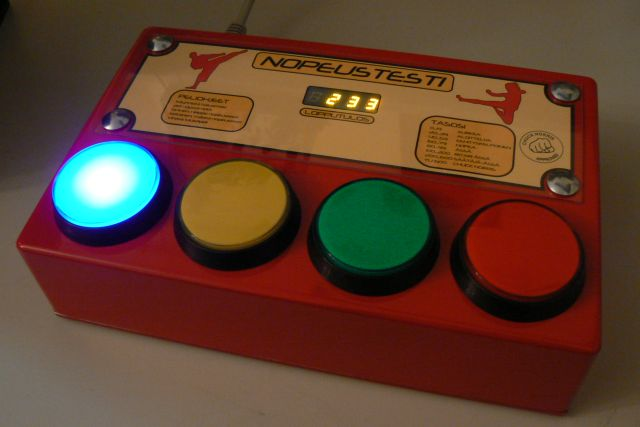

# Reaktiopeli



Tehtävänä on reaktiopeli, jossa tehtävänä on painaa sitä nappulaa, jonka valo
syttyy. Jokaisesta oikeasta painalluksesta saa pisteen, väärä painallus lopettaa
pelin. Nappuloiden vaihtumisnopeus kiihtyy jatkuvasti.
(https://www.youtube.com/watch?v=nv_Wfhz38EM).

Application uses ```socket.io```.

Data are stored in objects.

## Start game just in browser
1. Pitää avaa ```index-local.html```

## Multiplay game
### Localhost
1.  Pitää asettaa <a href="https://nodejs.org/en/" target="_blank">```NodeJS```</a>

### On the server
1. Avaakaa <a href="http://35.199.32.16/" target="_blank">```ReaktioPeli```</a>
2. Syötäkaa Sinun 'nimesi'
3. Painakaa nappia

Sinun tulokset ja muita pelaajien tuloksia voi hakea alempi.
Ensimmäisellä rivillä on pelaaja jolla on useimmat pisteet.
Toisella rivillä on seuraava pelaaja ja n.e.

Tulokset päivitetään dynaamisesti.

## Docker
Jos Sinä haluat, Sinä voit aloittaa pelin käyttämällä Dokeri:lla.

Ensinnäkin pitää asettaa Docker:a

1. Linux / iOS: sudo docker pull s1900624/reaktiopeli_local

   Windows: docker pull s1900624/reaktiopeli

2. Linux / iOS: sudo docker run -d -p 3000:3000 --name reaktiopeli s1900624/reaktiopeli_local:latest
    
   Windows: docker run -d -p 3000:3000 --name reaktiopeli s1900624/reaktiopeli_local:latest
    

P.S. 
This application could and do not use Docker because for this task Docker does not use all own opportunities. 

But for example, if have to use Redis or MySQL or other DB/serveses so can use  in this application Docker for uping envirement.

Or need move application to other server so Docker could help to make easy this one. 